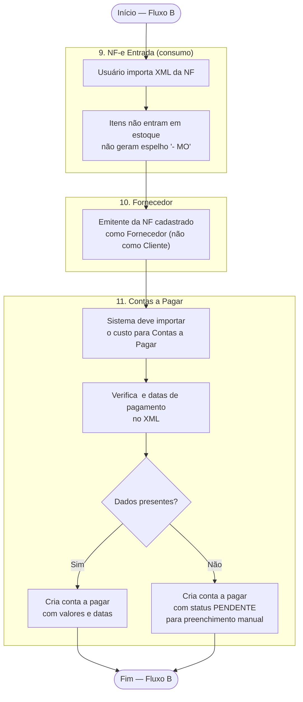
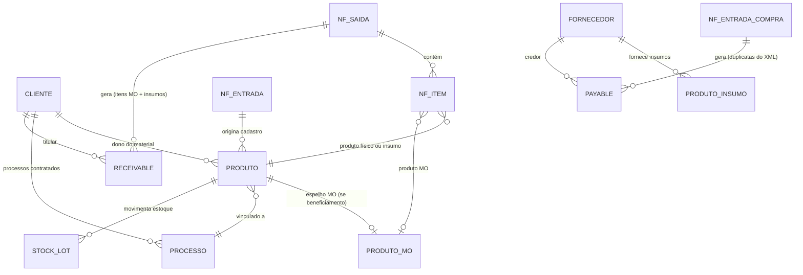
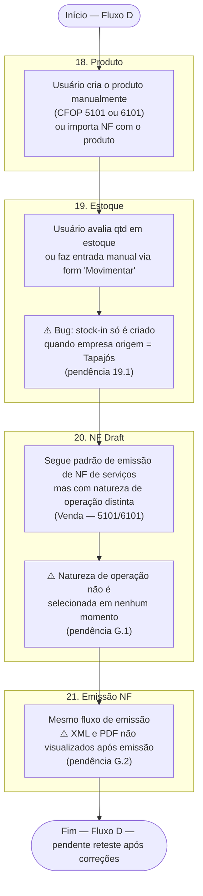
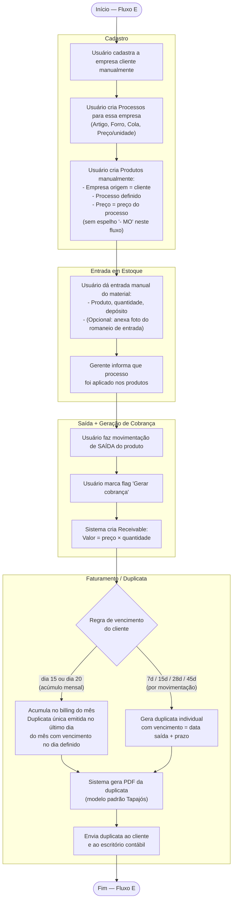

# Fluxo Operacional — ERP Tapajós

> Documento gerado a partir dos testes reais de uso.

---

## Fluxo A — Beneficiamento + Cobrança por Serviço

> Material recebido do cliente → processado → devolvido com cobrança do serviço.

```mermaid
flowchart TD
    A([Início — Fluxo A]) --> B

    subgraph ENTRADA_A["1. NF-e Entrada (material do cliente)"]
        B["Recebe XML da NF por e-mail\n(cliente envia)"]
        B --> C["Importa XML no ERP"]
        C --> D["Sistema registra itens\ne dados do remetente (cliente)"]
    end

    D --> E

    subgraph PRODUTOS_A["2. Cadastro de Produtos"]
        E["Itens da NF cadastrados como Produtos"]
        E --> F["Para cada item físico:\ncria espelho '- MO'\n(CFOP e OSN distintos)"]
        F --> G["Produto Físico = material recebido\nProduto MO = serviço cobrado na NF de saída"]
    end

    G --> H

    subgraph PROCESSOS_A["3. Processos"]
        H["Usuário cria Processos para o cliente\n(Artigo, Forro, Cola, Preço/unidade)"]
    end

    H --> I

    subgraph VINCULO_A["4. Vinculação Produto ↔ Processo"]
        I["Produto Físico recebe o Processo"]
        I --> J["Produto MO herda o Processo\ne recebe o Preço da tabela de Processos\n(valor cobrado na NF de saída)"]
    end

    J --> K

    subgraph ESTOQUE_A["5. Movimentação de Estoque"]
        K["Entrada: qtd conforme NF de entrada"]
        K --> L["Gerente informa que material\npassou pelo processo"]
        L --> M["Usuário seleciona: NF / Item / Processo / Empresa\ne clica em Emitir NF"]
    end

    M --> N

    subgraph DRAFT_A["6. NF de Saída — Draft"]
        N["Tela exibe pares: Produto Físico + MO"]
        N --> O["Usuário confere itens, valores, destinatário"]
        O --> Q["Cria Draft"]
    end

    Q --> R

    subgraph EMISSAO_A["7. NF de Saída — Emissão"]
        R["Localiza Draft → Finalizar"]
        R --> S["Confere: emitente (Tapajós), destinatário,\nitens, impostos, transporte, cobrança/fatura"]
        S --> T["Emite NF → autorizada na SEFAZ"]
    end

    T --> U

    subgraph FINANCEIRO_A["8. A Receber"]
        U["Sistema gera título:\n- Valor = soma itens MO\n- Vencimento = regra do cliente"]
    end

    U --> V([Fim — Fluxo A])
```

---

## Fluxo B — NF de Itens de Consumo (sem entrada em estoque)

> Fornecedor emite NF de itens de consumo da Tapajós (ex: materiais, serviços internos).

---

## Fluxo C — Insumos (entrada em estoque + cobrança ao cliente)

> Tapajós compra insumos, aplica em processos e cobra do cliente na NF de saída como linha separada.

```mermaid
flowchart TD
    A3([Início — Fluxo C]) --> B3

    subgraph ENTRADA_C["12. NF-e Entrada (compra de insumos)"]
        B3["Importa NF do fornecedor\n(NF de venda do fornecedor = NF de compra da Tapajós)"]
    end

    B3 --> C3

    subgraph PRODUTOS_C["13. Produtos (insumos)"]
        C3["Itens cadastrados como Produto\nsem espelho '- MO'"]
        C3 --> D3["Usuário localiza o SKU importado\ne calcula novo valor em 'Transformação Insumo'\n(considera conversão de unidade + margem)"]
        D3 --> E3["Campo Preço editável:\n- m² → m: template de cálculo\n- m já: aplica % margem\n- kg: cálculo manual"]
    end

    E3 --> F3

    subgraph ESTOQUE_C["14. Estoque (conversão de unidade)"]
        F3["Entrada: qtd conforme NF"]
        F3 --> G3["Usuário clica em 'Converter':\n- Qtd original\n- Fator de conversão\n- Unidade final\n- Empresa destino"]
        G3 --> H3["Sistema atualiza:\nunidade, quantidade e empresa\n→ requer F5 para visualizar (pendência 14.1)"]
        H3 --> I3["Gerente informa: insumo foi consumido\nno processo Y do item X do cliente"]
        I3 --> J3["Usuário seleciona item do cliente\n+ insumo e clica em Emitir NF"]
    end

    J3 --> K3

    subgraph DRAFT_C["15. NF de Saída — Draft (com insumo)"]
        K3["Tela exibe:\n- Produto Físico\n- Espelho '- MO'\n- Insumo (qtd total)"]
        K3 --> L3["Usuário calcula qtd de insumo consumida\ne ajusta manualmente o campo qtd"]
        L3 --> M3["Valor do insumo = preço atualizado\nno form de produtos (já com margem)"]
        M3 --> N3["Confere itens e cria Draft"]
    end

    N3 --> O3

    subgraph EMISSAO_C["16. NF de Saída — Emissão"]
        O3["Mesmo fluxo do item 7\nValor de cobrança inclui itens MO + insumos"]
    end

    O3 --> P3

    subgraph PAGAR_C["17. Contas a Pagar (NF do fornecedor)"]
        P3["Importação da NF de compra\ndeve gerar itens em Contas a Pagar"]
        P3 --> Q3{"<dup> presente no XML?"}
        Q3 -->|Sim| R3["Cria parcelas com\ndatas e valores do <dup>"]
        Q3 -->|Não| S3["Cria conta a pagar PENDENTE\npara preenchimento manual"]
    end

    R3 & S3 --> T3([Fim — Fluxo C])
```

---

## Regras de Negócio Identificadas

| # | Regra |
|---|-------|
| RN-01 | Todo produto físico de beneficiamento possui espelho `- MO` para cobrança do serviço |
| RN-02 | O produto MO herda o processo do produto físico e usa o preço da tabela de processos |
| RN-03 | A NF de saída contém pares: produto físico (devolução) + produto MO (serviço) |
| RN-04 | Insumos aparecem como linha adicional na NF de saída, com preço já com margem aplicada |
| RN-05 | O título a receber é gerado com base nos itens MO + insumos da NF emitida |
| RN-06 | A data de vencimento do título segue a regra configurada no cadastro do cliente |
| RN-07 | O emitente da NF de saída é sempre a Tapajós |
| RN-08 | NF de consumo (sem estoque) gera conta a pagar; NF de insumos também gera conta a pagar com as duplicatas do XML |
| RN-09 | Emitentes de NF de entrada são cadastrados como Fornecedores, não como Clientes |
| RN-10 | Cliente criado na importação de NF pode ter campos incompletos — NF de saída bloqueada até preenchimento obrigatório |
| RN-11 | Regras de vencimento do cliente: dia 15 mês seguinte, dia 20, 7d, 15d, 28d ou 45d após emissão |
| RN-12 | Opções dia 15 / dia 20: consolidam todas as NFs do mês em uma única duplicata emitida no último dia do mês |

---

## Entidades Envolvidas

---

## Fluxo D — NF de Venda (tecidos, malha, residual de insumos)

> Tapajós vende material próprio ou excedente de insumo. CFOP 5101/6101.

---

## Fluxo E — Cobrança sem NF-e (romaneio manual)

> Cliente envia material sem NF. Tapajós registra entrada manualmente, aplica processo e cobra por saída de estoque com geração de receivable/duplicata — sem emissão de NF-e.

---

## Variações de Importação de NF (comportamentos validados)

| Situação | Comportamento esperado | Status |
|----------|----------------------|--------|
| Insumo já cadastrado, em estoque | Não atualiza cadastro do produto; cria nova entrada de estoque | ✅ OK |
| Insumo já cadastrado, sem estoque | Não atualiza cadastro do produto; cria nova entrada de estoque | ✅ OK |
| NF padrão (produto já cadastrado) | Não sobrescreve dados editados pelo usuário; dá entrada no estoque | ✅ OK |
| NF de triangulação (cliente envia via terceiro, ex: tinturaria) | Fluxo normal; empresa do produto não pode ser alterada (FK) — usuário ajusta na emissão da NF | ✅ OK (limitação conhecida) |

---

## Regras de Negócio Identificadas

| # | Regra |
|---|-------|
| RN-01 | Todo produto físico de beneficiamento possui espelho `- MO` para cobrança do serviço |
| RN-02 | O produto MO herda o processo do produto físico e usa o preço da tabela de processos |
| RN-03 | A NF de saída contém pares: produto físico (devolução) + produto MO (serviço) |
| RN-04 | Insumos aparecem como linha adicional na NF de saída, com preço já com margem aplicada |
| RN-05 | O título a receber é gerado com base nos itens MO + insumos da NF emitida |
| RN-06 | A data de vencimento do título segue a regra configurada no cadastro do cliente |
| RN-07 | O emitente da NF de saída é sempre a Tapajós |
| RN-08 | NF de consumo e NF de compra de insumos geram contas a pagar; duplicatas do XML são usadas quando presentes |
| RN-09 | Emitentes de NF de entrada são cadastrados como Fornecedores, não como Clientes |
| RN-10 | Cliente criado na importação de NF pode ter campos incompletos — NF de saída bloqueada até preenchimento obrigatório |
| RN-11 | Regras de vencimento: dia 15/mês seguinte, dia 20/mês seguinte, 7d, 15d, 28d ou 45d após emissão |
| RN-12 | Opções dia 15 / dia 20: consolidam todas as NFs do mês em uma única duplicata, emitida no último dia do mês |
| RN-13 | Reimportação de NF com produto já cadastrado não sobrescreve edições do usuário; apenas cria nova entrada de estoque |
| RN-14 | NF de triangulação segue o fluxo normal; ajuste de empresa ocorre na tela de emissão |
| RN-15 | A natureza de operação deve ser selecionada durante a emissão da NF |
| RN-16 | Fluxo E (sem NF): cobrança gerada via flag "Gerar cobrança" na saída de estoque — sem emissão de NF-e |
| RN-17 | A duplicata/fatura segue modelo padrão Tapajós e é gerada automaticamente ao fechar o billing |
| RN-18 | PDF e XML da NF emitida são enviados automaticamente ao cliente e ao escritório contábil |

---

## Entidades Envolvidas

---

## Status dos Testes

| Etapa | Fluxo | Status | Observação |
|-------|-------|--------|------------|
| 1. NF-e Entrada | A | ✅ OK | |
| 2. Cadastro de Produtos (beneficiamento) | A | ✅ OK | |
| 3. Processos | A | ✅ OK | |
| 4. Vinculação Produto ↔ Processo | A | ✅ OK | |
| 5. Movimentação de Estoque | A | ✅ OK | |
| 6. NF Draft | A | ✅ OK | |
| 7. Emissão NF | A | ⚠️ Parcial | Pendências 7.1–7.4 |
| 8. A Receber | A | ❌ NOK | Pendência 8.1 |
| 9. NF-e Entrada (consumo) | B | ✅ OK | |
| 10. Cadastro de Fornecedor | B | ✅ OK | |
| 11. Contas a Pagar (consumo) | B | ❌ NOK | Pendência 11.1 |
| 12. NF-e Entrada (insumos) | C | ✅ OK | |
| 13. Produtos (insumos + cálculo) | C | ⚠️ Parcial | Pendências 13.1, 13.2 |
| 14. Estoque (conversão) | C | ⚠️ Parcial | Pendências 14.1, 14.2 |
| 15. NF Draft (com insumo) | C | ✅ OK | Pendência 15.2 |
| 16. Emissão NF (com insumo) | C | ⚠️ Parcial | Pendência 16.1 |
| 17. Contas a Pagar (insumos) | C | ❌ NOK | Pendência 17.1 |
| 18. Produto (venda) | D | ✅ OK | |
| 19. Estoque (entrada manual) | D | ❌ NOK | Pendência 19.1 — bloqueia testes seguintes |
| 20. NF Draft (venda) | D | ⏸️ Bloqueado | Aguarda correção 19.1 |
| 21. Emissão NF (venda) | D | ⏸️ Bloqueado | Aguarda correção 19.1 + G.1 + G.2 |
| E. Fluxo sem NF (romaneio) | E | 🔲 Não testado | Aguarda implementação flag "Gerar cobrança" + PDF duplicata |

---

_Atualizado em: 2026-03-25_
